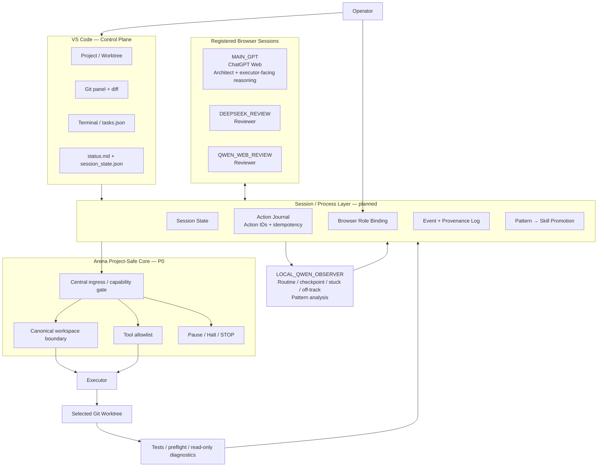

# Agent-Agent Architecture — Project-Safe Development Loop

Status: **architecture checkpoint / implementation contract**  
Branch: `hardening/project-safe-v0`  
Scope: local development workflow built on the Arena fork.

This document freezes the architecture agreed before further implementation. It
is intentionally stricter than upstream Arena defaults. The goal is to preserve
project integrity while allowing browser LLMs, a local Qwen observer, Arena
tools, Git worktrees and VS Code to participate in one controlled workflow.

## 1. System goal

Create a local, resumable development loop in which:

- VS Code is the operator control plane and project workspace;
- one explicitly selected Git worktree is the only mutable project area;
- ChatGPT Web acts as the main architect + executor-facing reasoning surface;
- DeepSeek Web and Qwen Web may later act as reviewers;
- local Qwen acts as an observer/analyst, not as the security authority;
- Arena is the local transport/execution harness;
- deterministic policy code decides ALLOW / DENY / NEED_USER;
- every mutation is attributable to a proposal/review/action chain;
- Pause / Resume / Stop are first-class states;
- quota/context/rate-limit conditions pause instead of causing retry storms.

The system must not depend on VS Code for security. VS Code is the operator UI;
Arena project-safe policy and, where needed, OS isolation form the security
boundary.

## 2. Core architecture



## 3. Non-negotiable security invariants

### 3.1 Security is core, not proxy

An outer orchestrator is **not** a security boundary.

Every executable ingress exposed by the Arena process must either:

1. pass through the same project-safe capability policy; or
2. be unreachable / denied while project-safe mode is active.

This includes MCP, REST, browser-extension execution, task/mission paths,
gateways, secondary protocol surfaces and any other mutating entry point.

If a new ingress cannot be proven to be gated, P0 remains FAIL.

### 3.2 One canonical workspace boundary

Project-safe mode requires an explicit workspace/worktree root.

Rules:

- whole user home is not a valid project-safe root;
- relative paths resolve against the configured root;
- canonical target must remain under the canonical root;
- direct `.git` internals are not exposed as ordinary file operations;
- path validation must account for Windows path semantics;
- traversal, symlink/junction/reparse escape, UNC/drive-relative edge cases and
  nonexistent write targets must be tested explicitly;
- string-prefix checks such as `startswith(root)` are forbidden as a boundary.

### 3.3 Whitelist tools, do not blacklist shell strings

Project-safe mode exposes only the tools required by the current stage.

Baseline:

- read/search/list workspace: allowed;
- Git status/diff/log: allowed;
- workspace edit/create/write: separately enabled;
- arbitrary host shell: denied;
- package/program installation: denied;
- network/tunnels/webhooks: denied;
- service/autostart/registry/admin changes: denied;
- desktop/mobile control: denied;
- Git push/reset/commit automation: denied in v0;
- agent-authored code execution: denied in v0 until its Windows isolation path
  is validated separately.

The local Qwen observer never overrides this policy.

## 4. Roles

### Operator

The operator owns:

- project/worktree selection;
- browser role binding;
- manual escalation decisions;
- enabling write mode;
- enabling any future AUTO skill;
- creation of a new browser conversation after context exhaustion;
- final merge/push decisions.

### MAIN_GPT

ChatGPT Web is the primary architect and reasoning surface. It may propose
project actions and receive execution/test results. It is not granted host-wide
authority merely because it proposes an action.

### Browser reviewers

DeepSeek Web and Qwen Web are advisory reviewers. They provide criticism,
alternatives and risk observations. They do not form a security boundary and
their agreement is not treated as proof.

### Local Qwen observer

Local Qwen is a project observer and analyst.

Planned responsibilities:

- classify routine / checkpoint / stuck / off-track;
- summarize structured project events;
- detect repeated workflow patterns;
- propose skill candidates;
- optionally act as a browser-adapter fallback by proposing locators from a
  restricted semantic DOM/accessibility snapshot.

Local Qwen must **not** decide filesystem/security permission. Deterministic
code does that.

## 5. Browser role binding

Browser automation may operate only on tabs explicitly registered by the
operator for the current project session.

A future binding record should contain at least:

```text
provider
tab_id
origin
conversation_fingerprint
assigned_role
session_id
```

Before an automatic browser action, the binding is revalidated.

If the tab disappeared, origin changed, or the conversation fingerprint no
longer matches, state becomes `WAITING_USER`. The system must not silently
search for a "similar" tab or bind a different personal conversation.

Global clipboard/key logging is out of scope. Semantic system events such as
`MESSAGE_FORWARDED` are preferred over observing Ctrl+C/Ctrl+V.

## 6. State machine

One action is in flight at a time.

```text
IDLE
  -> RUNNING
  -> WAITING_MODEL
  -> REVIEWING
  -> EXECUTING
  -> VERIFYING
  -> RUNNING

Exceptional / operator states:
  NEED_USER
  LIMIT_REACHED
  PAUSED
  INTERRUPTED
  STOPPED
```

Rules:

- slow model generation is WAITING, not failure;
- 429/quota/cooldown does not trigger a retry storm;
- explicit Retry-After may be honored; otherwise resume requires policy/operator
  action;
- two unexpected execution failures should pause/escalate;
- context exhaustion produces a full stop; no automatic new browser chat;
- Resume must reconstruct state from persisted records, not model memory.

## 6.1 Browser interaction budget / pacing

Browser-facing models are treated as slow external advisory services.

The detailed policy is defined in:

- `docs/BROWSER_INTERACTION_PACING_POLICY.md`

Core invariants:

- one in-flight interaction per provider;
- no retry storms;
- explicit quota/rate-limit signals move the provider to `LIMIT_REACHED`;
- slow generation is `WAITING_MODEL`, not failure;
- no global clipboard/key logging;
- only registered project browser bindings may be forwarded/logged;
- browser payloads are compact review packets, not routine shell chatter;
- pacing is deterministic resource control, not human-behavior simulation;
- no automatic creation of replacement chats/accounts to bypass limits;
- auto-submit remains OFF until the provider workflow is explicitly approved.

## 7. Session state, action journal and provenance

These are separate concerns.

### Session State

Answers: *where are we now?*

Examples:

- project/session ID;
- goal;
- current stage;
- selected workspace;
- registered browser roles;
- current/pending action;
- pause/limit state.

### Action Journal

Answers: *what did the system do?*

Each action gets a stable `action_id`.

Required lifecycle example:

```text
PROPOSED -> REVIEWED -> READY -> EXECUTING -> VERIFIED
                               \-> FAILED
                               \-> INTERRUPTED
                               \-> DENIED
```

Replaying an already completed `action_id` returns the recorded result instead
of executing it a second time.

### Event + Provenance Log

Answers: *why did the system do it and where did the idea come from?*

A mutating action is incomplete unless it can link to its origin:

```text
proposal_id
  -> review_id(s)
  -> operator decision when required
  -> action_id
  -> workspace SHA before
  -> workspace SHA / result after
  -> verification/test event
```

Local Qwen receives structured semantic events, not a raw giant terminal/chat
log.

## 8. Learning mode and skills

Autonomy grows only after evidence.

```text
OBSERVE
  -> SUGGEST
  -> ASSIST
  -> AUTO
```

Pattern/skill lifecycle:

```text
PATTERN
  -> SKILL_CANDIDATE
  -> APPROVED
  -> ASSIST_ONLY
  -> AUTO_ELIGIBLE
  -> AUTO   (operator explicitly enables)
```

A skill is a declarative workflow, not a replay of historical shell commands.

Example shape:

```yaml
skill: architecture_review
version: 1
trigger:
  type: ARCHITECTURE_CHANGE
flow:
  - forward: DEEPSEEK_REVIEW
  - wait
  - return_review: MAIN_GPT
limits:
  max_rounds: 2
on_uncertainty: NEED_USER
forbidden:
  - execute_shell
  - install
  - git_push
```

Browser selector/adaptor caches are stored separately from workflow skills.

## 9. Browser-adapter fallback hierarchy

Preferred order:

```text
known deterministic adapter
  -> semantic/accessibility lookup
  -> validated local cache
  -> local Qwen locator candidates
  -> deterministic candidate validation
  -> NEED_USER
```

Qwen is a fallback locator proposer, not the final validator.

## 10. VS Code control plane

V0 uses existing VS Code primitives only:

- project/worktree explorer;
- Git panel and diff;
- terminal;
- `.vscode/tasks.json`;
- future `session_state.json`;
- future `status.md`.

A custom VS Code sidebar/webview is explicitly postponed until the state machine
and required fields stabilize.

## 11. Implementation order

No parallel feature expansion.

```text
P0  Arena project-safe core, fail-closed
P1  Session state + action journal + idempotency
P2  One MAIN_GPT browser role binding
P3  Structured event + provenance collector
P4  Local Qwen in OBSERVE mode
P5  Second browser reviewer
P6  Pattern -> skill candidates / promotion
P7  VS Code UI refinement
```

No new orchestrator implementation should begin before P0 is proven.

## 12. P0 definition of done

P0 is PASS only when:

1. all executable ingress paths are inventoried;
2. every mutating ingress is proved to pass project-safe policy or is denied;
3. one canonical path validator is used for relevant project file/Git paths;
4. Windows boundary tests cover traversal, case/path variants, symlink/junction/
   reparse escape, UNC/drive-relative paths and nonexistent write targets;
5. project-safe defaults fail closed when root/policy information is missing;
6. project-safe browser execution remains manual-confirm;
7. arbitrary host shell/system installation/tunnels/autostart are unavailable;
8. targeted tests pass on the intended Windows environment;
9. the draft PR remains unmerged until these checks are evidenced.

## 13. Current implementation status

Implemented on `hardening/project-safe-v0` before this checkpoint:

- explicit project root launcher;
- cautious profile instead of owner-shell;
- no automatic dependency installation in the safe launcher;
- no automatic killing of the process using port 8765;
- local state/token directory;
- project-safe MCP tool allowlist;
- MCP filesystem/search/diff/Git moved toward configured-root enforcement;
- whole-home fallback rejected in project-safe mode;
- browser-extension scope reduced to ChatGPT / DeepSeek / Qwen + localhost;
- browser safe-auto-run forced off in project-safe policy;
- targeted project-safe tests added;
- draft PR #1 opened.

Not yet accepted as complete:

- full ingress/entry-point audit;
- central REST/secondary-ingress closure;
- Windows path boundary matrix execution;
- proof against junction/reparse/TOCTOU escape;
- CI/runtime validation on the target Windows machine.

Those open items are the next P0 work and must be resolved before P1.
